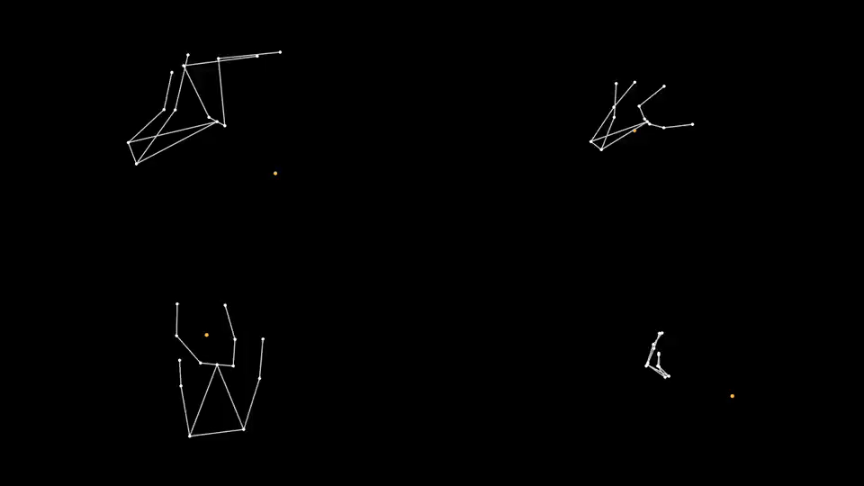

# Correlated Kinetics from Monocular Video: 

This repo implements a correlation–path analysis of batting kinetics from short monocular video. From each clip we detect 2D keypoints and a bat tip, root‑center and scale‑normalize, smooth and differentiate, estimate a single in‑plane swing axis, and compute time‑lagged correlations among segments. We then extract a single directed chain—the maximum‑weight correlation path—that summarizes how motion flows from the lower body to the bat. The representation is intentionally minimal (one swing axis, one timeline, one chain), grounded in the physics of proximal‑to‑distal sequencing and designed for legibility via economy, directionality, and salience.

---

## Six canonical shots (2×3, synchronized)
[](docs/assets/ik_shots_2x3.mp4)

## Corresponding skeletons (2×3, synchronized)
[](docs/assets/ik_skeletons_2x3.mp4)


Shots (left→right, top→bottom): cover drive, down the ground, hook 2, inside edge, off‑drive (50), square drive.

> For independent tiles with Play‑All controls, open [`docs/index.html`](docs/index.html).

---

## Corresponding skeletons (2×3, synchronized)

[](docs/assets/ik_skeletons_2x3.mp4)

Skeletons are derived from the above six clips with a consistent fps, crop, and duration.

---

## Working Notes

**Pose & alignment.** 

Let $\mathbf{x}_j(t)\in\mathbb{R}^2$ be the 2D keypoint for joint $j$ at time $t$. We Procrustes‑align sequences to remove camera pan/zoom:

$$
\min_{s,\mathbf{R},\mathbf{t}} \sum_{t,j}
\left\lVert \mathbf{x}^{(i)}_{j}(t) - \big(s\,\mathbf{R}\,\mathbf{x}^{(\mathrm{ref})}_{j}(t)+\mathbf{t}\big) \right\rVert_2^2,
\quad \mathbf{R}\in \mathrm{SO}(2).
$$

**Kinematics.** Centered differences approximate velocities/accelerations:

$$
\dot{\mathbf{x}}_j(t) \approx \frac{\mathbf{x}_j(t+\Delta t)-\mathbf{x}_j(t-\Delta t)}{2\Delta t}, \qquad
\ddot{\mathbf{x}}_j(t) \approx \frac{\mathbf{x}_j(t+\Delta t)-2\mathbf{x}_j(t)+\mathbf{x}_j(t-\Delta t)}{\Delta t^2}.
$$

Optionally smooth with a Savitzky–Golay filter before differentiating.

**Bat head speed & angular velocity.** If $ \mathbf{b}(t) $ is the bat tip proxy and $ \mathbf{h}(t) $ a hand/wrist proxy,

$$
\omega_z(t) = \frac{d}{dt}\,\arg\!\big(\mathbf{b}(t)-\mathbf{h}(t)\big),\qquad
v_{\text{tip}}(t)=\left\lVert \dot{\mathbf{b}}(t) \right\rVert_2.
$$

**Temporal alignment (DTW).** Compare two shots $\{\mathbf{f}_i\} $ and $\{\mathbf{g}_j\}$:

$$
D(i,j)=\lVert \mathbf{f}_i - \mathbf{g}_j \rVert_2^2 + \min\{D(i-1,j),\,D(i,j-1),\,D(i-1,j-1)\}, \quad D(0,0)=0,
$$

yielding the correlation paths (`*_corrpath.png`).

**LoRA for catching batter's technique ** With base weights $\mathbf{W}$ and LoRA rank $r$,
$$
\mathbf{W}'=\mathbf{W}+\Delta\mathbf{W},\quad \Delta\mathbf{W}=\alpha\,\frac{1}{r}\,\mathbf{A}\mathbf{B},
$$
trained via the denoising loss
$$
\mathcal{L} = \mathbb{E}_{\mathbf{x},\epsilon,t}\Big[
\big\lVert \epsilon - \epsilon_\theta(\sqrt{\bar{\alpha}_t}\mathbf{x} + \sqrt{1-\bar{\alpha}_t}\epsilon, t, \mathbf{c}) \big\rVert_2^2
\Big],
$$
with conditioning \( \mathbf{c} \) from text/pose.

---

## 🧪 Reproducibility

Build the composites shown above:
```bash
./scripts/build_composites.sh
